# Azure DevOps and Automation

These excerise will show you the basics of creating an Azure DevOps pipeline to deploy infrastructure as code using Bicep. We will start with a simple pipeline and then enhance it step by step to include more features such as environments and approvals. While we are deploying a Bicep file, no Bicep knowledge is required for this lab.

### Prequisites:
- Access to an Azure DevOps organization and project
- The Bicep file `infra\main.bicep` in this repository uploaded to your Azure DevOps repository (to `infra\main.bicep`)

  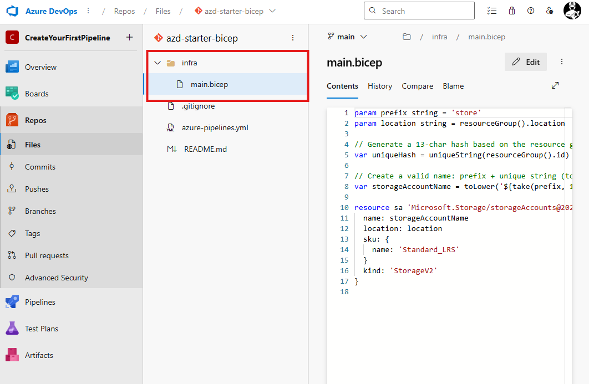
  
- A service connection to your subscription created in the Azure DevOps project (the name does not matter, we will update the pipeline to use it later)

  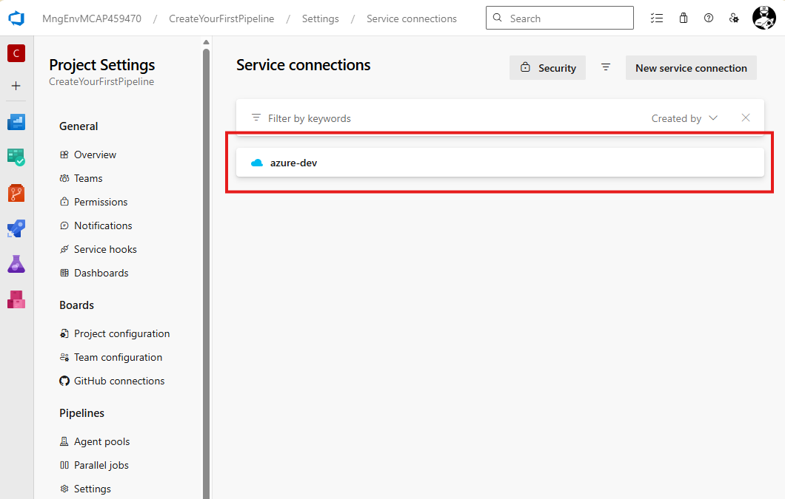

### Module 1 - Create your first pipeline

In this module will we create a starter pipeline and make we can run it. This pipline will not connect to Azure or do anything useful, but it will show you how to create a pipeline in Azure DevOps, and how to run it and look at the logs.

1. In Azure DevOps, navigate to Pipelines and click 'New Pipeline'
2. On the "Where is your code?" screen, select 'Azure Repos Git' and then select your repository. If more than one repository is present, select the one that contains the Bicep file called out in the prequisites.
3. On the "Configure your pipeline" screen, select 'Starter pipeline'. This an empty pipeline with a simple script that just prints "Hello, world!" to the logs.
4. You should see something like this. This is pipeline as code, the pipeline is defined in a YAML file. You can edit this file to change the pipeline directly in the Azure DevOps portal, but remember this is just a file in your repository and will be managed like any other file. Review the conets of the filWe won't be making any changes to the file in this module, but will do so in the next modules.

   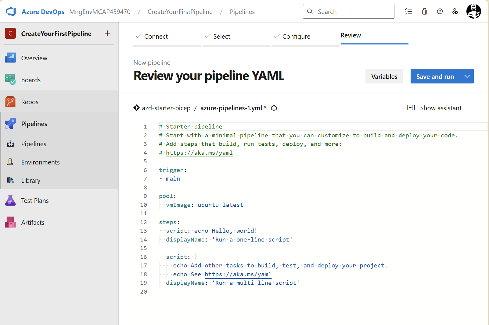

5. If you are sharing your repo with others, change the name of the pipeline YAML file to something unique to you by clicking on the name of the file:

    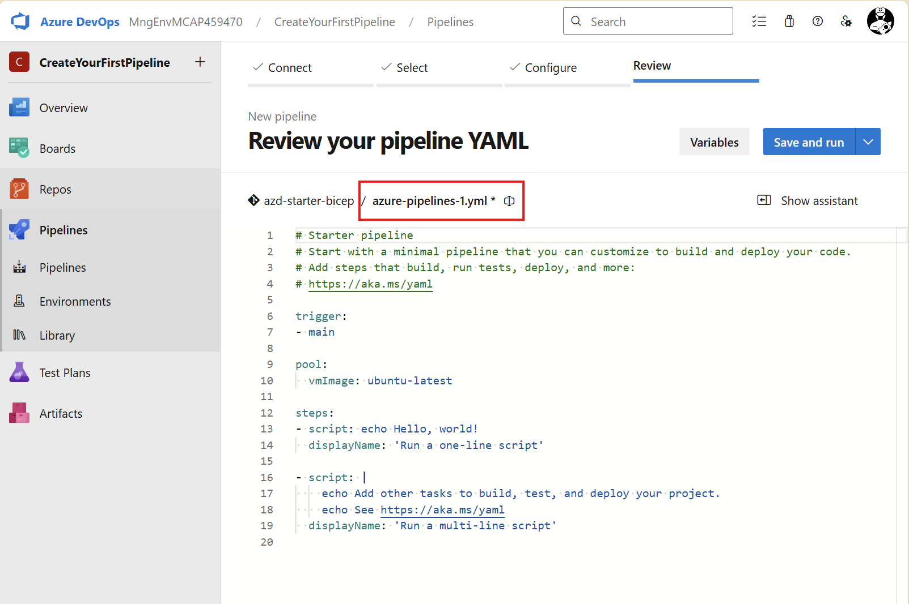

6. Click "Save and run". This will first prompt you to commit the new pipeline YAML file (remember this is just another file in your repo and is managed like any other source code file). You can add a commit message if you want, but it's not required. Click "Save and run" again to commit the file and run the pipeline. You will do this every time you make a change to the pipeline in the next modules - we'll assume you know how to do this and won't call out this step every time.

7. The pipline will start running and you will see a page similar to the one below when it is complete. As the pipline progresses you can see the updates in real time. Click into the Job to a more detailed view of the tasks, and the logs for each task. There should be a task called "Run a one-line script" with the script "echo Hello, world!" and the logs should show the output of that script. You can click "Run New" to run the pipeline again, and also go back to the Pipelines page to see all runs of the pipeline and their status (note if you are in a shared project you can see everyone's piplines, so find yours in the list and click into it to see the run history)

    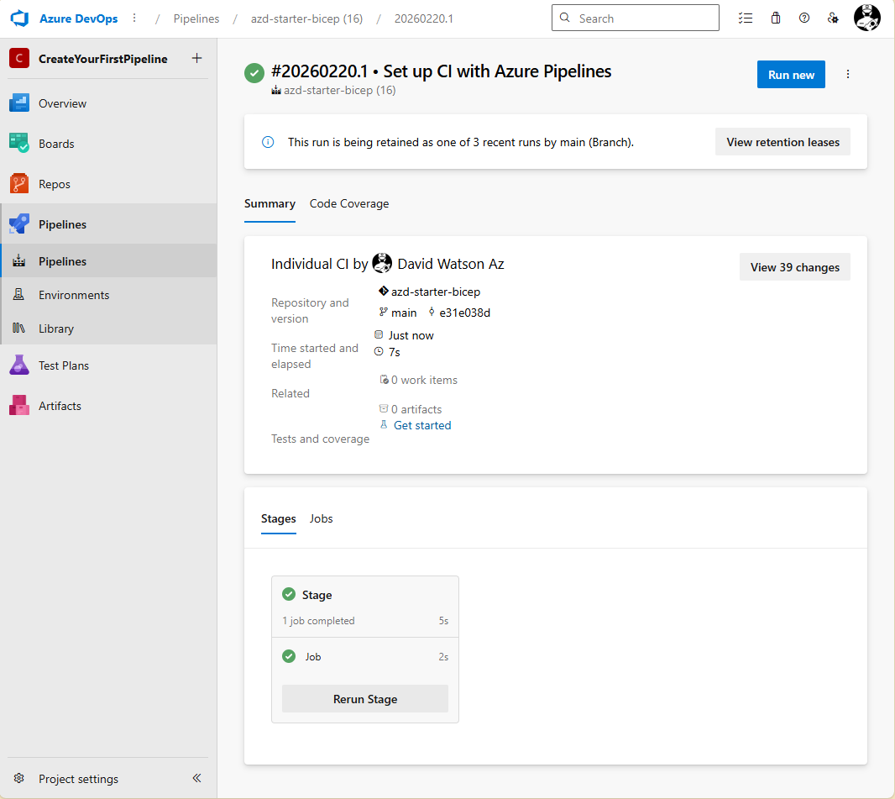

### Module 2 - Connect your pipeline to Azure and validate your Bicep file

Now that we can successfully run a pipeline, let's make it do something useful - validate our Bicep file. In the broader DevOps context this constitutes a Continuous Integration (CI) process, and is the sort of check that is typically run every time a change is made to a template file (if this was an application development process this is where would check if we can successful build the application and run unit tests). No actual deployment happens at this stage. We are using a Tasks that does require a connection to Azure though, so we will need to update the pipeline to use the service connection you created in the prequisites.

1. From the "All" pipeline view, click into your pipeline and then click "Edit" to edit the pipeline YAML file. You should see the contents of the starter pipeline YAML file that was created in the previous module, this is where will make our changes to connect to Azure and validate the Bicep file (if the Tasks pane open to the right you can close it, we will be editing the YAML file directly not using the assistant).
2. Select all the contents of the pipline YAML file and replace with the code below. Update the value of `service-connection` variable to match the name of the service connection you created in the prequisites. This pipeline has a single stage called `Validate` with a single job called `Lint` that runs an Azure CLI task to validate the Bicep file. The task uses the Azure CLI command `az bicep build` which compiles the Bicep file and checks for any errors. If there are any errors in the Bicep file, the task will fail and the pipeline will stop.
A few things to note about the pipeline YAML:
    - The `trigger: none` at the top means this pipeline will not run automatically on any changes. We will be running it manually for now, but in a real project you would likely want to trigger the pipeline on changes to your infrastructure code, for example on changes to any files in an `infra` folder.
    - The file contains both variables and parameters. Parameters are used to pass values into the pipeline at runtime, while variables are used to store values that can be used throughout the pipeline. In this pipeline we have a parameter for the resource group name, which allows us to specify the target resource group when we run the pipeline, and variables for the template file path, location, and service connection name that will be reused in multiple places in the pipeline.
    - Tasks typicall have a small `settings` hyperlink that will open a pane with the details of the task configuration. This is useful to understand what each task is doing and what inputs it requires. You can click on the settings link above the `AzureCLI` task to see the details of how the task is configured.
    ``` yaml
    trigger:
    none

    # For demo purposes, we will trigger the pipeline manually. In a real project, you would likely want to trigger on changes to your infrastructure code, for example:
    # trigger:
    #   branches:
    #     include: [main]
    #   paths:
    #     include: [infra/**]

    parameters:
    - name: rgNameParam
    displayName: Target resource group name
    type: string

    variables:
    templateFile: 'infra/main.bicep'
    rgName: ${{ parameters.rgNameParam }}
    location: 'australiaeast'
    service-connection: 'YOUR SERVICE CONNECTION NAME HERE'

    stages:
    - stage: Validate
        jobs:
        - job: Lint
            steps:
            - task: AzureCLI@2
                inputs:
                azureSubscription: '$(service-connection)'
                scriptType: bash
                scriptLocation: inlineScript
                inlineScript: az bicep build --file $(templateFile) --verbose
    ```
    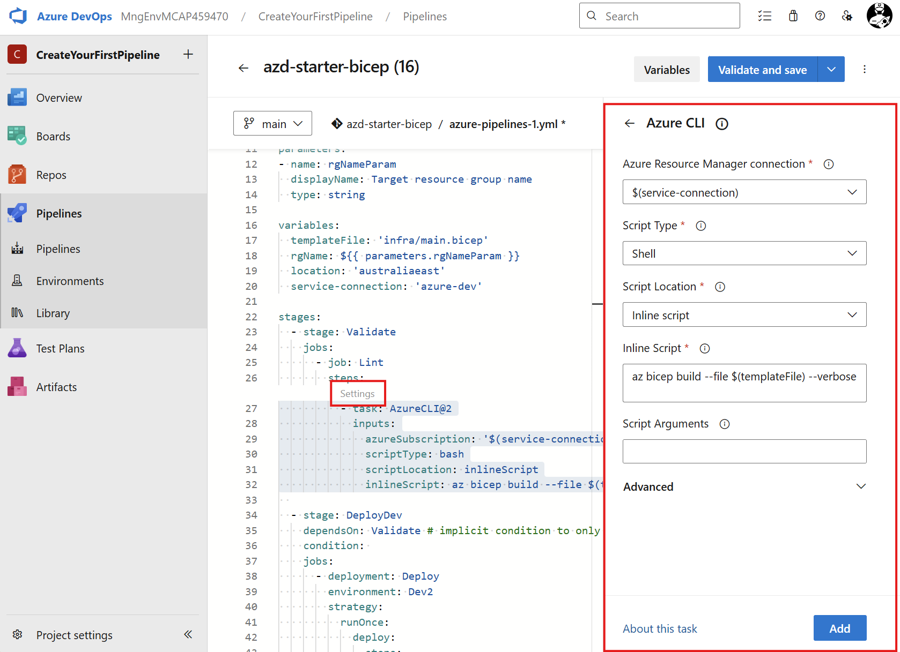
3. Click "Validate and Save". You may get an error saying that "A value for the 'rgNameParam' parameter must be provided", but you can click "Save anyway" (this will not cause as issue when we run the pipeline as we will provide a value for the parameter then). Click "Save" again to commit the changes to the pipeline YAML file.
4. Run the pipline by clicking "Run". You will be prompted to provide a value for the "Target resource group name" (the `rgNameParam` parameter). Enter the name of the resource group you have been assigned for this lab, and click "Next:Resources"

    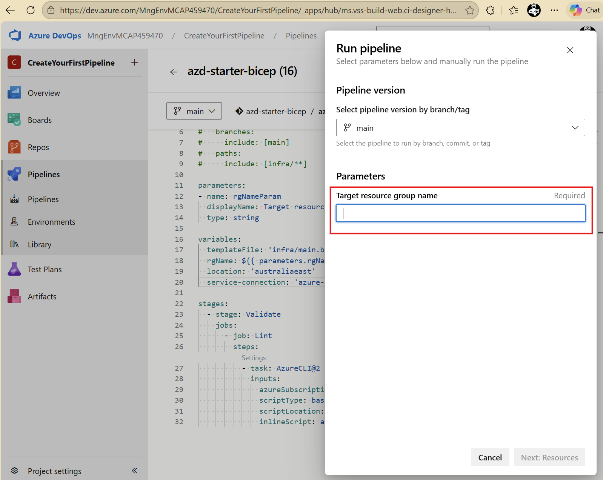

5. Click "Run" to start the pipeline. If this is the first time you have used the service connection in a pipeline, you may be prompted to authorize the pipeline to use the service connection. Click "View" and then "Permit", and then "Permit" again to authorize the pipeline to use the service connection.

    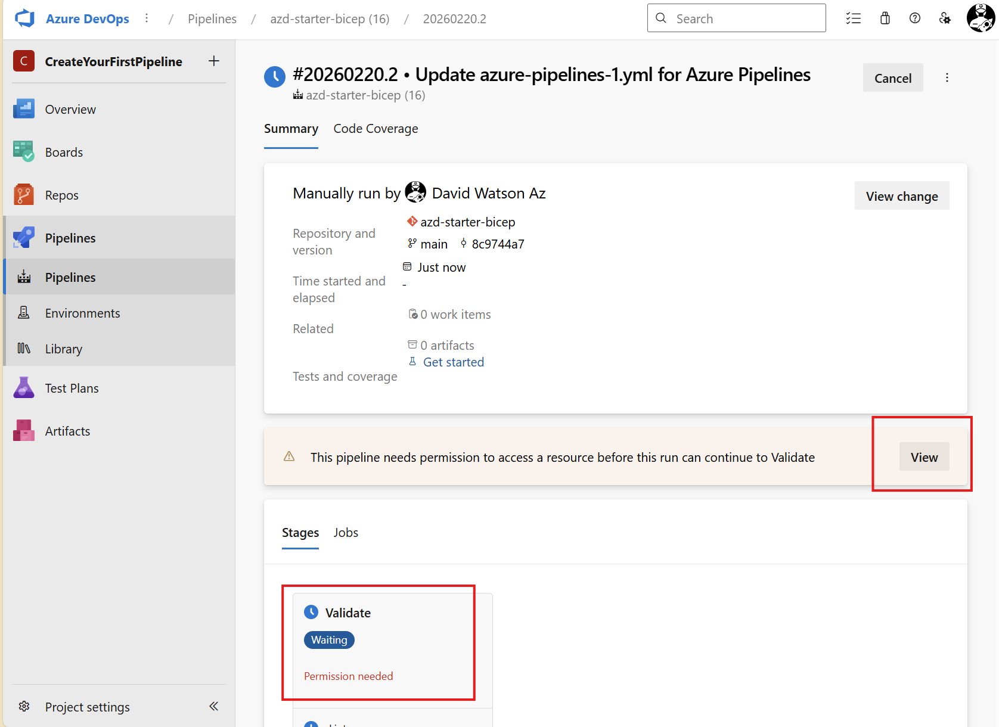
    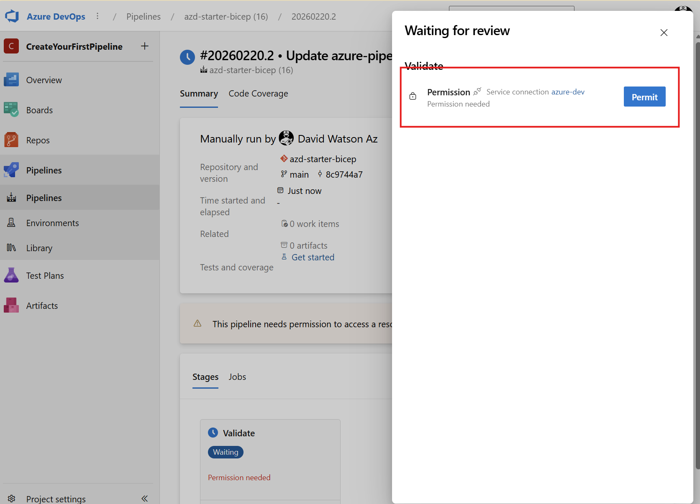

6.  The pipeline will run the Azure CLI task which will attempt to validate the Bicep file. If there are any errors in the Bicep file, the task will fail. Click into the Lint job to see the output of the `az bicep build` command - if the command succeeds there will just be a INFO line with timing information, if there are errors you will see the error messages in the logs.

### Module 3 - Deploy your infrastructure to Azure

Now that we have a CI procress in place we can add a Continuous Deployment (CD) process to deploy the infrastructure to Azure. CI and CD are often thought of as separate processes, but often they are just different stages in the same pipeline. The CI stage is responsible for validating and building the code, while the CD stage is responsible for deploying the code. In some environments there can be CI only piplines that are run on every change, but typically there is always a CI/CD pipeline that will run the full process from validation to deployment, and this is what we will create here.

In this module we will add a new stage to the pipeline that runs after the validation stage and deploys the Bicep file to Azure. 

1. Edit the pipeline file again and paste the YAML below to the end of your pipeline - this will add a second stage to the pipeline. Note that YAML is very sensitive to indentation, so make sure that the `- stage: DeployDev` line is at the same indentation level as the `- stage: Validate` line above it. 

    ``` yaml
    - stage: DeployDev
        dependsOn: Validate # implicit condition to only run if dependant stage succeeds
        condition: 
        jobs:
        - deployment: Deploy
            environment: Dev
            strategy:
            runOnce:
                deploy:
                steps:
                    - checkout: self
                    - task: AzureResourceManagerTemplateDeployment@3
                      inputs:
                        azureResourceManagerConnection: '$(service-connection)'
                        resourceGroupName: '$(rgName)'
                        location: '$(location)'
                        csmFile: '$(templateFile)'
    ```
    A few things to note about this new stage:
    - The `dependsOn: Validate` means this stage will only run if the Validate stage succeeds.
    - This stage has a single job of type `deployment`, which is a special type of job in Azure DevOps that is used for deploying to environments. This gives us some additional features such as the ability to specify an environment and use deployment strategies, but at its core it's still just a job that runs some tasks. If the Dev envrionment does not already exist in Azure DevOps, it will be automatically created when we run the pipeline.
    - The stage has a `checkout: self` step which checks out the code from the repository (including our Bicep file). Even though we ran the same task in the previous stage we need to check out the code again in this stage as each stage can potentially run on a different agent and does not share any state with the previous stage.
    - We have an `AzureResourceManagerTemplateDeployment` task to deploy the Bicep file. This task can be used to deploy both ARM templates and Bicep files (it will automatically compile the Bicep file before deployment). The `azureResourceManagerConnection` input is used to specify the service connection to use for the deployment, and the `csmFile` input is used to specify the path to the Bicep file to deploy. Click on the `settings` link for this task to see more details.
2. Save and run this updated pipeline. You may need to give the pipeline permission to deploy to the newly created Dev environment, but the process is that same as when you gave the pipeline permission to use the service connection. Now that we have a two stages in our pipeline, we will see both stages when we run the pipeline. The first stage will validate the Bicep file, and if that succeeds the second stage will deploy the Bicep file to Azure. You can click into each stage to see the details and logs for each stage - check the `AzureResourceManagerTemplateDeployment` task logs to see the details of the deployment.

    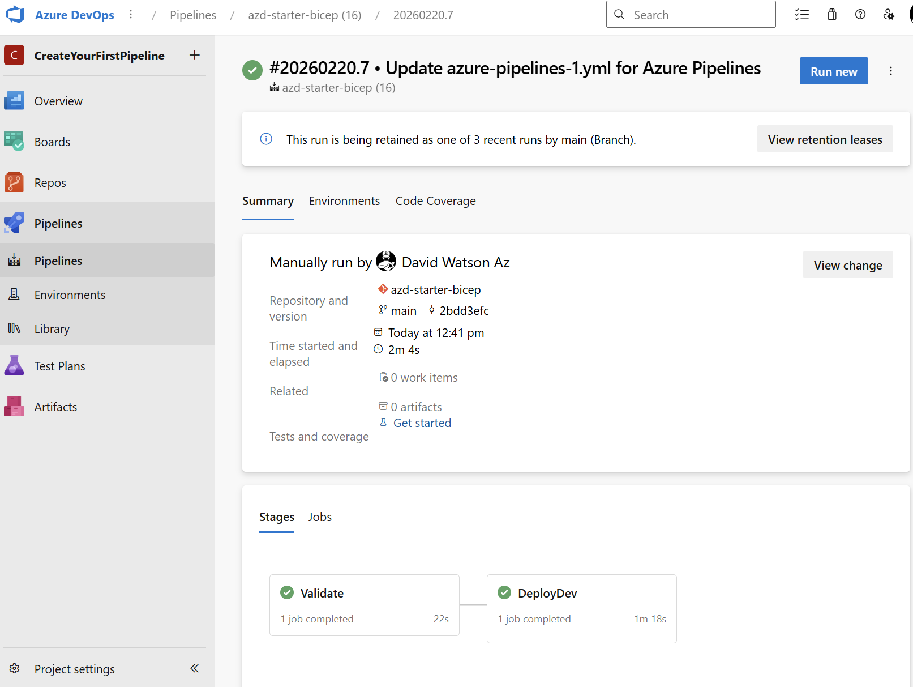

3. As we have now also deployed the infrastructure, you can go to the Azure portal and look at the resource group that was deployed to see the storage account that was created. You can also check the "Deployments" section of the resource group to see the details of the deployment and the resources that were created.


### Module 4 - Add a production environment and approval control

In the final module we will add a "production" environment to our configuration and an approval control for deployments to this environment. This is a common pattern in real world pipelines where you have multiple environments (e.g. Dev, Test, Prod) and you want to have some control over when deployments to certain environments are allowed to happen. In this module we will add a manual approval control, but there are also other types of controls you can add such as checks for work items, or automated gates that check for certain conditions before allowing a deployment to proceed.

1. In Azure DevOps, navigate to "Pipelines" and then "Environments". Click "New environment" and create a new environment called `Prod[your initials]` (e.g `ProdDW`) to create a unique environment just for you. An environment in Azure DevOps doesn't need to correspond to any actual resources in Azure (although it can in some cases), and if this is a shared project we  You don't need to add any resources to this environment, we just need the environment itself to be able to add it to our pipeline.

    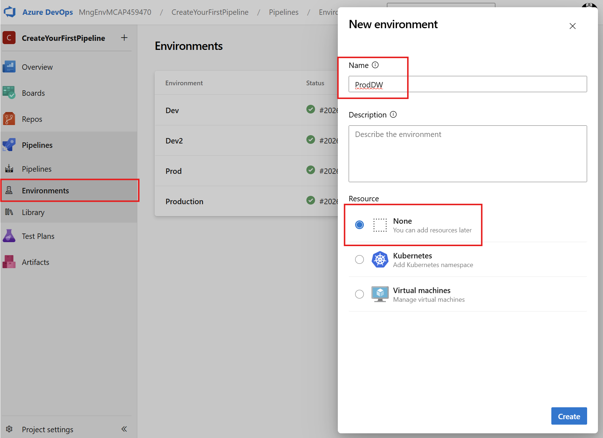
  
2. After the environment is created, click on the "Approvals and checks" tab. Click the "plus" button. You will see a list of different types of checks you can add.

    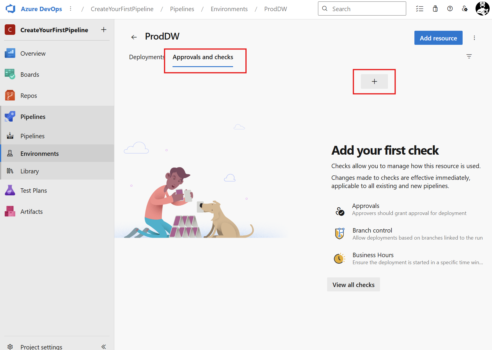

3.  Select "Approvals" and then "Next". Here you can add a Devops user or group as an approver for this environment. This means that any time a deployment is made to this environment, it will require approval from one of the specified approvers before the deployment can proceed. Add yourself as an approver and click "Create" to create the approval check. You will now see the production environment has an approval check configured.

    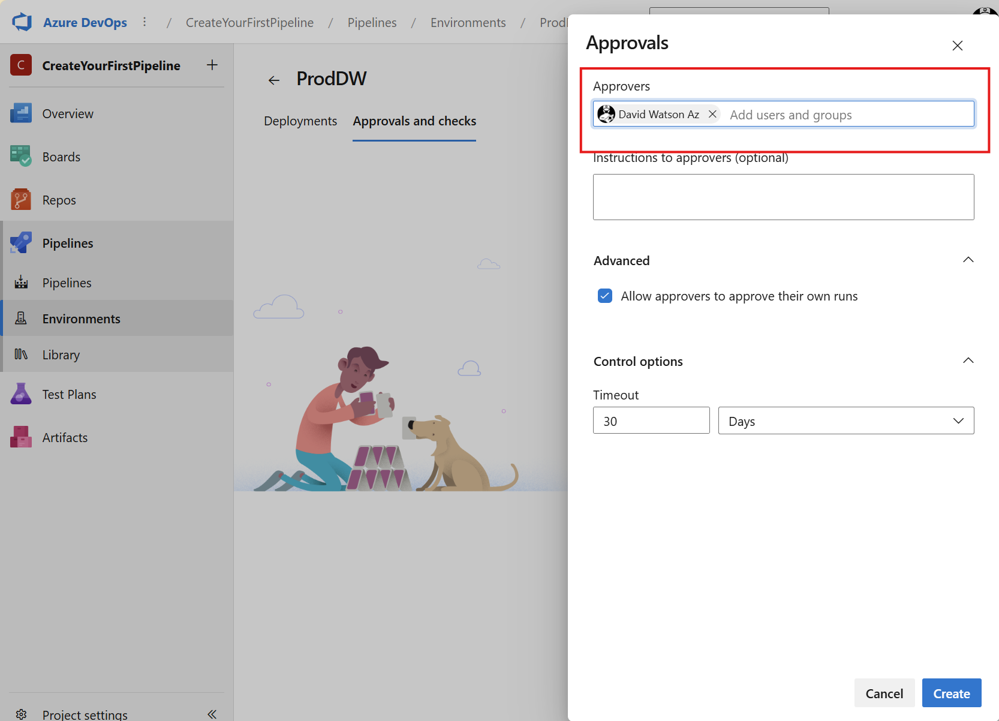

4. Now we will update our pipeline to add a new stage for deploying to this production environment. Edit your pipeline file and add the following code to the end of the file (make sure the indentation is correct). Update the environment name to match the prod environment you created earlier (e.g. `Prod[your initials]`). This stage is very similar to the DeployDev stage, with a few key differences:
- The `dependsOn: DeployDev` means this stage will only run if the DeployDev stage succeeds. This creates a sequential flow where the production deployment can only happen after a successful deployment to the dev environment.
- We have added a condition to this stage to only allow it to run if the pipeline is being run on the main branch (`refs/heads/main`). This is a common pattern to prevent deployments to production from feature branches or pull requests. Because we have added this condition we also need to add an explicit condition to only run if the previous stage succeeds. This is normally implied by the `dependsOn` but when you add a condition to a stage it overrides the default stage success condition so you need to add it back in manually.
- The environment for this stage is set to the production environment we created, which means it will require approval before the deployment can proceed. Unlike the lowe level conditions we specified in the `condition ` property, approvals are controlled at the environment level.
- You will also notice that the `AzureResourceManagerTemplateDeployment` tasks uses the same service connection as the DelpoyDev stage (so will deploy again to the same subscription). In a real project, you would likely have different service connections for different environments (e.g. a service connection with permissions to deploy to the dev subscription, and a different service connection with permissions to deploy to the prod subscription), but for the purposes of this lab we are using the same service connection for both stages.

    ``` yaml
      - stage: DeployProd
    dependsOn: DeployDev
    # only deploy to prod if deploying from main branch. Requires explicit check of previous stage success
    condition: and(succeeded('DeployDev'),eq(variables['Build.SourceBranch'], 'refs/heads/main'))
    jobs:
      - deployment: Deploy
        environment: Prod[your initials]
        strategy:
          runOnce:
            deploy:
              steps:
                - checkout: self
                - task: AzureResourceManagerTemplateDeployment@3
                  inputs:
                    azureResourceManagerConnection: '$(service-connection)' # would be a different subscription outside the lab environment
                    resourceGroupName: '$(rgName)'
                    location: '$(location)'
                    csmFile: '$(templateFile)'
    ```
5. Save and run the pipeline again. This time after the deployment to the dev environment succeeds, the pipeline will pause at the production deployment stage and wait for approval (you may actually see two checks - the first is the familiar check that the pipline has permission to deploy to the production environment (you may have needed to do this when you first ran against the Dev environment), and the second is the approval check that we just created). For the approval check you will see a "Review" button prompting you to review.

    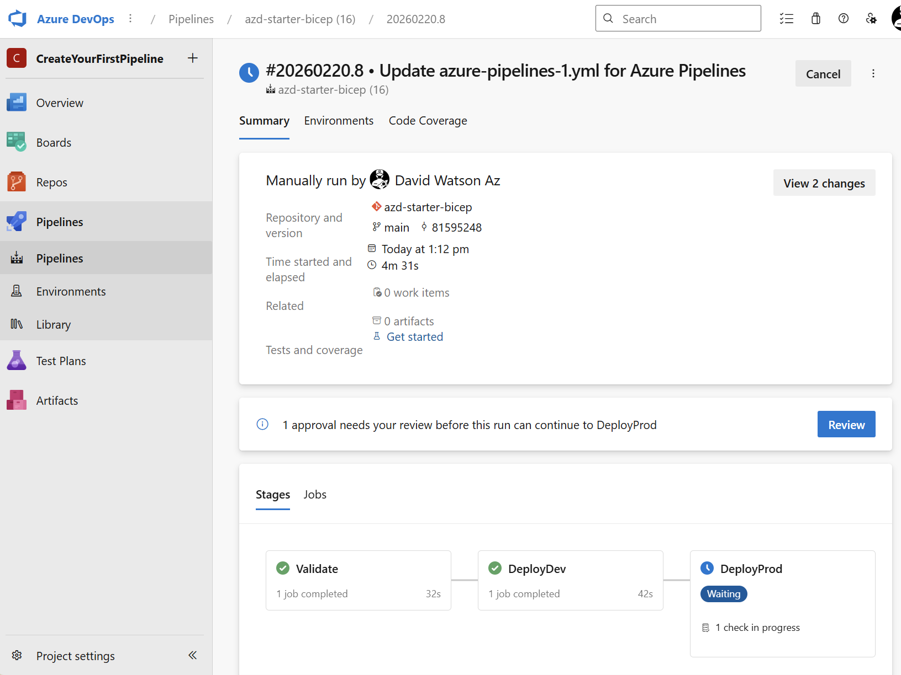

5. Click on the "Review" button. This will open a pane where you can see the details of the deployment and the changes that are being made. You can also add comments here if you want to provide feedback on the deployment. Click "Approve" to approve the deployment and allow it to proceed.
  (alternatively here you could return to the pipeline run list to see what the pipeline status looks like when it's waiting for approval. When you created the check you set a default timeout for the approval of 30 days so you have plenty of time! If approval is not given within the timeout period, the deployment will automatically fail).

    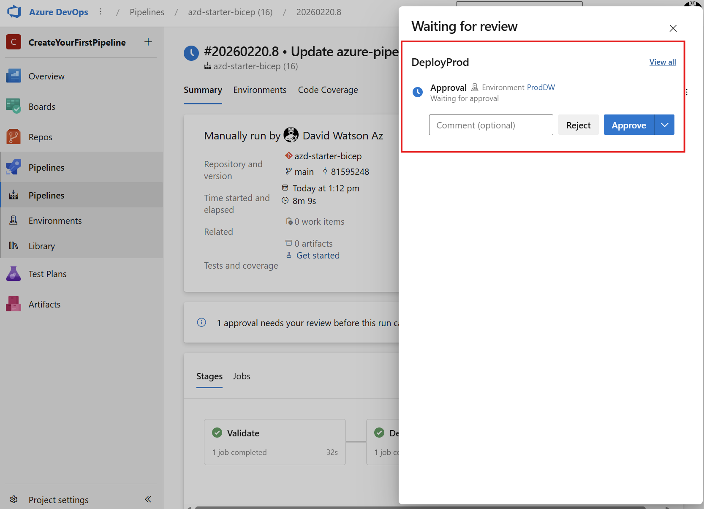

If you have completed all the modules in this lab you should now have a pipeline that validates and deploys your Bicep file to both a dev and prod environment, with an approval control in place for the prod deployment. 

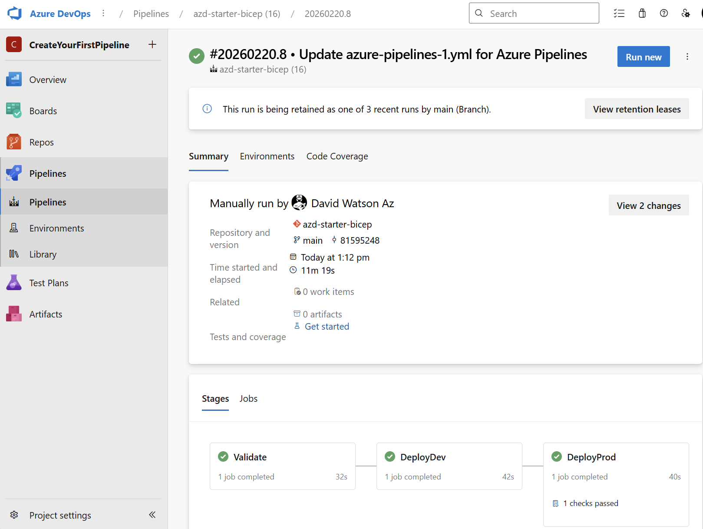