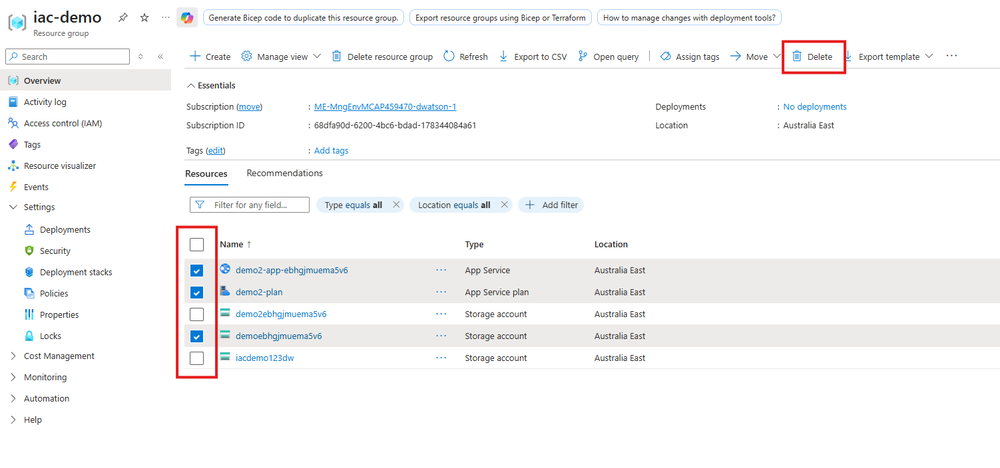
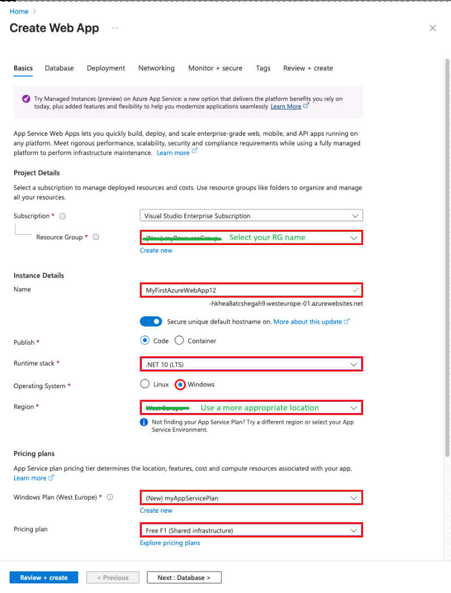
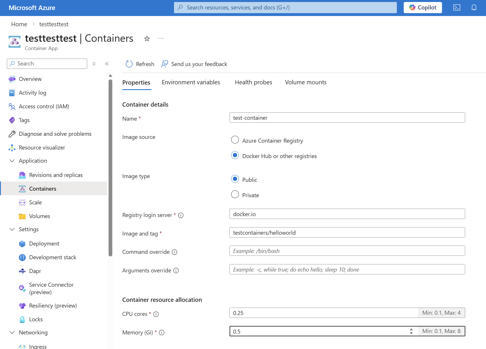
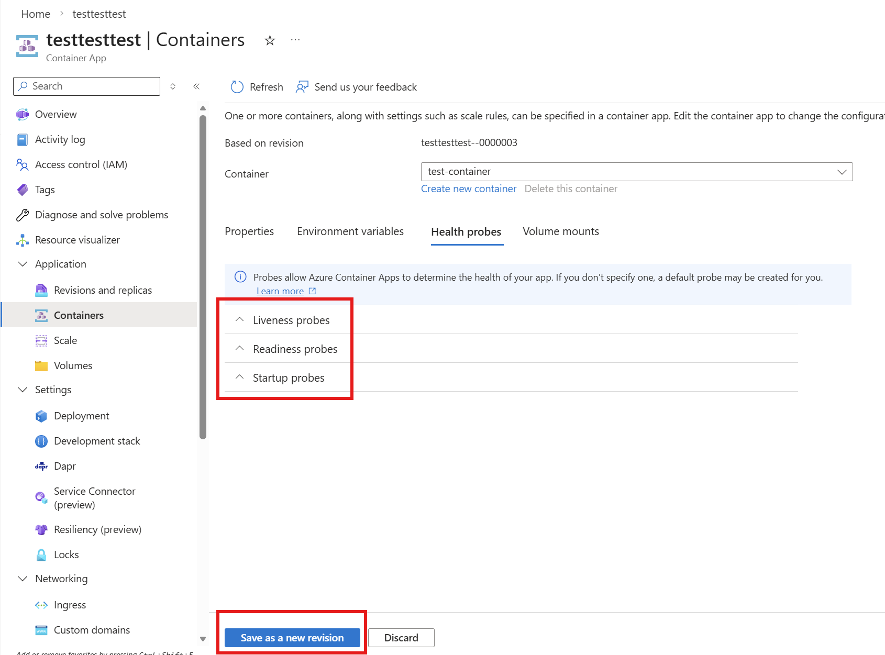
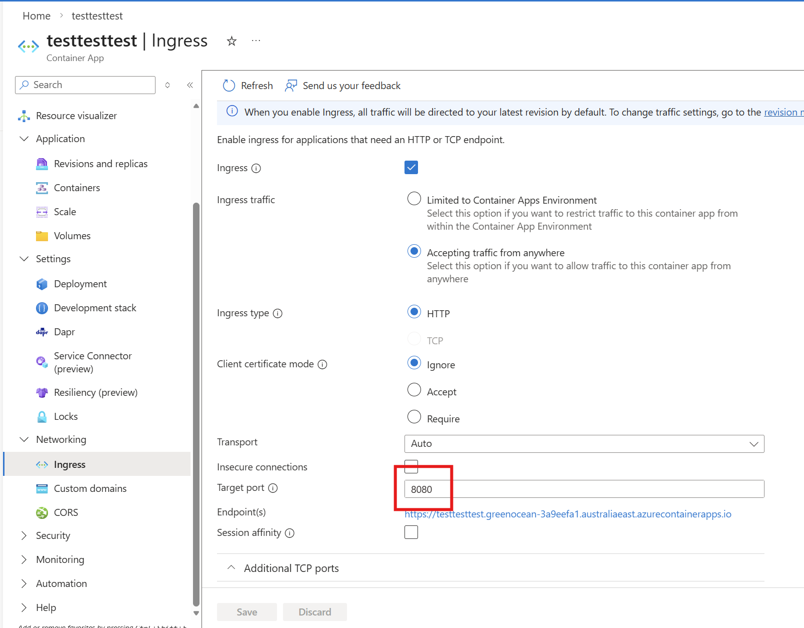
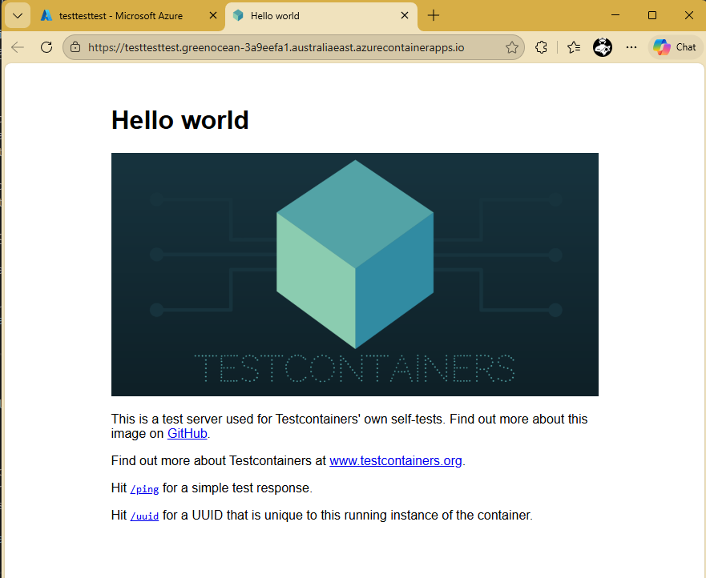
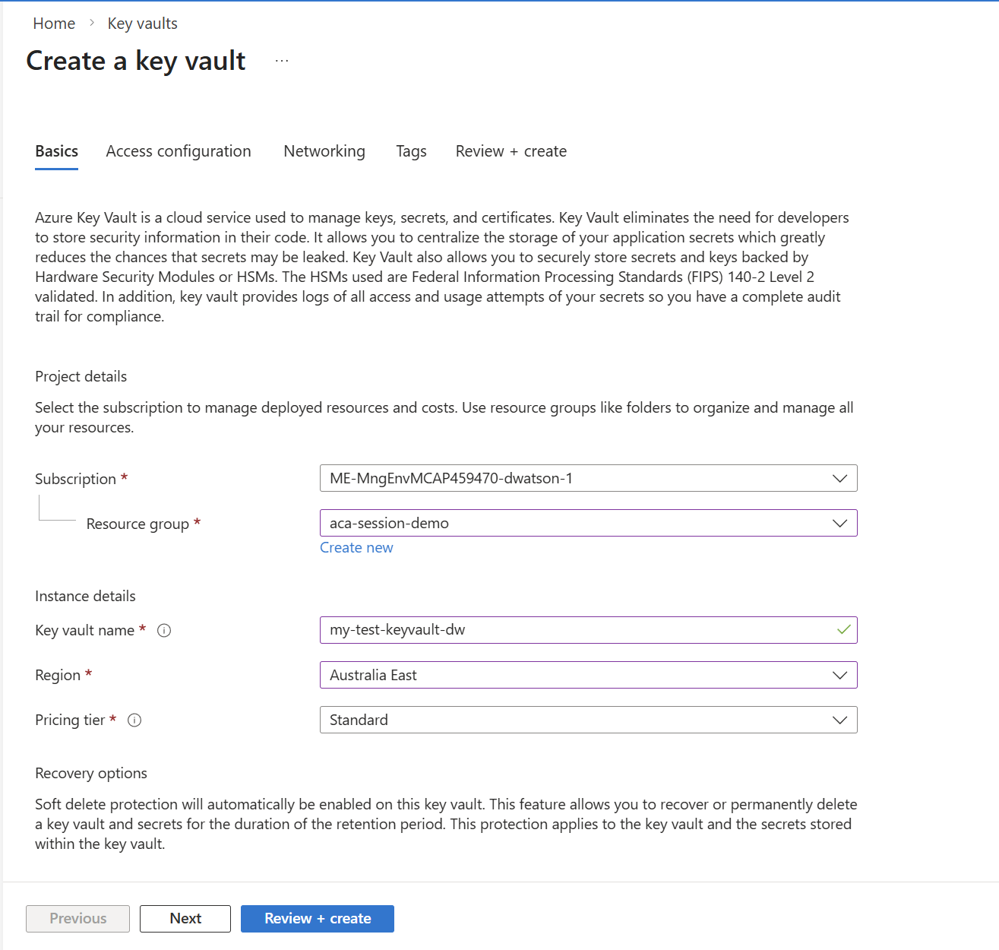
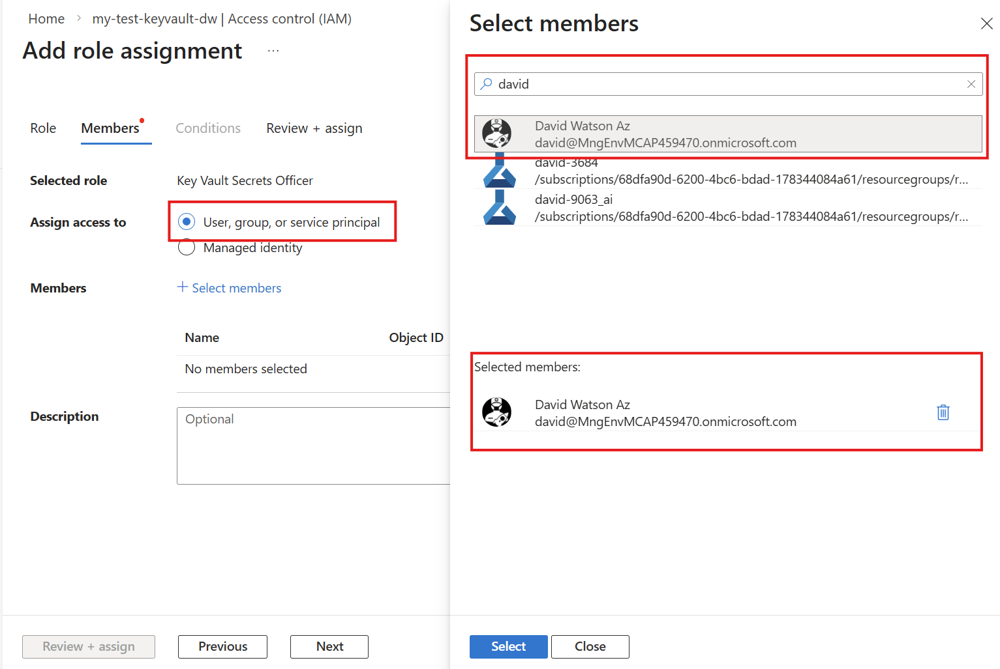

# App Platforms and Databases

These exercises will introduce you to some of the most commonly used Azure services for hosting applications and databases, including Azure App Service, Azure Container Apps, Azure Key Vault and Azure CosmosDB. You will learn how to create and configure these services using the Azure Portal, and how to use them to host a simple web application and store data.

All of these modules use the tutorials and quickstarts available in the Microsoft Learn documentation. These provide step by step instructions for creating and configuring the services, and are a great resource for learning how to use these services effectively. They also provide a number of options for completing the exercises - we recommend starting with the Azure Portal, but if you are feeling confident you can also complete the exercises using the Azure CLI (which you have used in previous labs). 

### Prerequisites:
- Access to an Azure subscription and an Azure resource group with sufficient permissions to create resources in the resource group 
- (optional if you wish to use the Azure CLI to create the services) Azure CLI installed and configured. See <a href="https://learn.microsoft.com/en-us/cli/azure/install-azure-cli-windows" target="_blank">here</a> for installation instructions. If you can't install the Azure CLI you could instead use the <a href="https://learn.microsoft.com/en-us/azure/cloud-shell/overview" target="_blank">Azure Cloud Shell in the Azure Portal</a>, which has the Azure CLI pre-installed and configured. Changes you make to files in the Cloud Shell may or may not persist, so it's recommended to use a local installation of the Azure CLI if possible.

> [!IMPORTANT]
While this is explicitly called out in the lab instructions where needed make sure you always use a location that is available in your subscription and close to you. e.g. If you are in Australia use `australiaeast`.

> [!IMPORTANT]
When you have finshed all of the modules in this lab make sure to clean up all of the resources you have created to avoid unnecessary costs. You can do from the resource group in the Azure portal by selecting all of the resources you created and pressing "Delete"

### Module 1 - Azure App Service

In this module we will deploy the Azure App Service and explore some of its configuration options. To get started follow "Publish your web app" section the quickstart guide below with the following adjustments:
1. In step 3, use the existing resource group you have been using for the labs instead of creating a new one.
1. Also in step 3, set the deployment region to a location that is available in your subscription and close to you (e.g. Australia East)
    
1. Skip steps 4, 5 and 6, unless you have access to a GitHub account and would like to deploy the sample application using GitHub Actions. You can still deploy the Azure App Service, but when you browse to the URL of the app service (step 10) you will see a default page instead of the sample application. The deployed app service is all you need for this excerise.

https://learn.microsoft.com/en-us/azure/app-service/quickstart-dotnetcore?tabs=net10&pivots=development-environment-azure-portal#publish-your-web-app

After you have deployed the app service you can skip to the "Manage the Azure app" section of the tutorial to explore some of the configuration options for the app service. In addition to the options covered in the tutorial you can also investigate some additional options such as:
* General configuration settings (under Settings -> Configuration)
* Identity options (under Settings -> Identity)
* Metrics (under Monitoring -> Metrics)
* The Kudu console (under Development Tools -> Advanced Tools) which provides a command line interface to the underlying App Service environment and can be used for troubleshooting and debugging.
* Options for distributing logs to other Azure services such as Azure Monitor (under Monitoring -> Diagnostic settings)
* Networking Options (under Settings -> Networking) such as VNet integration and private endpoints

> [!NOTE]
Note that some options may not be available as this app service has been deployed using the free tier. If allowed in your subscription you can try changing the pricing tier to a higher tier (e.g. B1) to unlock additional features and options for the app service. You can change the pricing tier by going to the "Scale up" option under the "Settings" section of your app service in the Azure Portal.

(A good comparison of the features and limits for each tier can be found [here](https://learn.microsoft.com/en-us/azure/azure-resource-manager/management/azure-subscription-service-limits#azure-app-service-limits))

### Module 2 - Azure Container Apps

In this module we will deploy an Azure Container App using a default container image, and then optionally with an alternative public container image from Docker Hub. Typically you would deploy a custom container image (containing your code) to a private container registry but as the focus of these exercises is on Azure services the public image provides a simple way to get started. 

To get started follow the quickstart guide below. This will create a simple Azure Container App using a default container image provided by Microsoft. Once you have completed the quickstart you can browse to the URL of your container app to see the default application running.

https://learn.microsoft.com/en-us/azure/container-apps/quickstart-portal

After this quickstart is completed you can optionally update the container app to use a different public container image from Docker Hub. To do this use the following steps:

1. From the Azure Portal, navigate to your container app and select "Application -> Containers" from the left hand menu and update the following container settings:

    

    * Name: "test-container"
    * Image source: "Docker Hub or other registries
    * Image Type: "Public"
    * Registry login server: "docker.io"
    * Image and tag: "testcontainers/helloworld"

    

1. Click on the "Health Probes" tab can clear all of the health probe check boxes. The new container image does not have the same endpoints as the default Microsoft image, and if these health probes are enabled the container app will continuously try to check the health of the container and fail, which will prevent the new revision of the container app from being deployed successfully. Container Apps will create new test probes for the new image.

    

1. Click "Set as new revision" to create a new revision of the container app with the updated container image. This will take a minutes or two - you can also check the status of the deployment of your new revision from the "Application -> Revisions and replicas" page of your container app in the Azure Portal.
1. In order to be able to view HTTP endpoint of the new image you will need to update the ingress settings - the previous container was expecting ingress on HTTP port 80, and the new container expects ingress on port 8080. To do this, navigate to "Networking -> Ingress", change the "Target Port" to 8080, and press "Save".

    

1. With the new revision deployed and the ingress settings updated, you can now browse to the URL of your container app to see the new test image running.

    

Azure Container Apps is a feature rich service with many options and features to explore. Some additional features you can investigate include:
* Scaling options ("Application -> Scale")
* Environment variables and secrets ("Application -> Containers -> Environment variables")
* Additional ingress setting ("Networking -> Ingress") 
* Live container and system logs ("Monitoring -> Log stream") 

### Module 3 - Azure Key Vault

In this module we will deploy an Azure Key Vault, create a secret in the key vault, and then (optionally) reference that secret from an Azure App Service. This is a common pattern for securely storing and accessing sensitive information such as connection strings, API keys and certificates from your applications. As for the previous modules we will be basing all of the exercises on the quickstart guides available in the Microsoft Learn documentation, with some adjustments to fit the scope of this lab. Follow the steps below to complete the exercises for this module:

1. Create and deploy a key vault. While there is a quickstart for this there are only a few steps required:

    1. From the Azure portal menu, or from the Home page, select Create a resource.
    2. In the Search box, enter Key Vault.
    3. From the results list, choose Key Vault.
    4. On the Key Vault section, choose Create.
    5. On the Create key vault section provide the following information:
        **Name**: A unique name is required. Choose a name that is unique to you. The portal will tell you if the name is already in use and you will need to choose a different name.
        **Subscription**: Choose a subscription.
        **Resource Group**: Select Use existing and choose the resource group you have been using for the labs.
        **Location**: In the Location pull-down menu, choose a location (e.g. Australia East) that is available in your subscription and close to you.
    1. Leave the other options to their defaults, click Review + create, then Create on the next page to create the key vault.
    

    When the deployment is complete click on "Go to resource" to navigate to your new key vault.

 1. Grant yourself permissions to manage secrets in the key vault. In Key Vault (as in many other Azure services) **management plane** operations (like creating a Key Vault resource) require separate permissions to **data plane** operations (like creating secrets in the key vault). While you have permissions to create a Key Vault, you do not have permissions to perform data plane operations on the key vault. This separation of responsibilities is critical in securing  sensitive information - teams in organisations who manage Azure infrastructure and services should not have access to business data stored in these services.  In order to complete this lab though you will need to grant yourself permissions to manage secrets in the key vault before you can create a secret. To do this, follow the guide in the link below - this is a common task for Azure administrators and the guide is not specific to Key Vault - the elements you need to update for this lab are listed below, as well as screenshots of some of the key stps in the process.

     https://learn.microsoft.com/en-us/azure/role-based-access-control/role-assignments-portal

  * The **scope** of the role assignement will be the keyvault you just created - you will open the role assignement page (from the "Access control (IAM)" link) from the key vault in the Azure Portal
  * The **role** you will assign is "Key Vault Secrets Officer", which allows you to manage secrets in the key vault (but not keys or certificates, and does not allow management plane operations like changing access policies or deleting the key vault). This is a Job Function role, and should appear in the list of roles when you search for it by name in the role assignement process. Take some time to look at the other Key Vault roles available.
  * You need to assign access tp a **user, group or service principal**, and in the Select member step you should search for your account

    

    

3. Create a secret in the key vault. Now that you have permissions to manage secrets in the key vault you can create a secret. To do this, follow the guide in the link below. It doesn't really matter what the secret is called, or what the value is, as long as you remember it so you can reference it in the next step when we add it to the app service configuration.

    https://learn.microsoft.com/en-us/azure/key-vault/secrets/quick-create-portal

3. Now that a secret has been added to the key vault you can optionally add a reference to that secret in an environment variable in the App Service you created in Module 1.  This is a very common usage of Azure Key Vault - sensitive information (e.g. an API key) required by an application can be securely stored and controlled in Key Vault, and App Service can make the value of this secret available to the application as an environment variable without the secret value ever being exposed in the App Service configuration. In many cases the secret itself can be generated via automation (e.g. generate an API key when an API service is provisionsed) and stored in Key Vault, and then the application can reference the secret from Key Vault without any human involvement or exposure of the secret value at any step of the process

    Acheiving this requires a few steps. The App Service needs to be given permission to read the secret (the same way you granted yourself secret permissions previously), but before we can do that the App Service requires an identity to grant this permission to. After the App Service has an identity and it has been granted persmission to read the secret, you can then add a reference to the secret in the App Service configuration. This process is outlined in the steps below:

    1. Navigate to your App Service in the Azure Portal, and select "Identity" from the left hand menu under "Settings". On the Identity page, switch the "Status" to "On" and click "Save" to enable a system assigned managed identity for your App Service. This will create an idenity for you App Service in Entra ID with the same name as your App Service.
    2. From the Key Vault you created follow the steps above to add a new role assignment, but this time assign the "Key Vault Secrets User" role to the managed identity of your App Service. This will allow your App Service to read secrets from the Key Vault, but not manage them (you can scope permissions to the actual secret level but for this excercise we will just grant access to the whole Key Vault for simplicity). To find the name of the App Service just search for the App Service name in the "Select member" step of the role assignment process.
    3. Now that permissions have been granted, go to your App Service in the Azure Portal and navigate to Settings -> Environment variables. Add a new environment variable (it doesn't matter what you call it) and set the value to a Key Vault reference in the format described in the guide below. After you apply the change (once to the new variable, then again on the App Setting page) you should see an indication that the value is being pulled from Key Vault, and if you click on the value you can see details of the Key Vault reference including the name of the Key Vault and the secret name.

      https://learn.microsoft.com/en-us/azure/app-service/app-service-key-vault-references?tabs=azure-cli#-understand-source-app-settings-from-key-vault

### Module 4 - CosmosDB

In the final module we will deploy an Azure CosmosDB account, create a database and a container, and add some data to the container. Follow the quickstart guide below:

https://learn.microsoft.com/en-us/azure/cosmos-db/quickstart-portal

Some things to note as you follow this quickstart:
* The name you chose for your CosmosDB account must be globally unique, as it will be used as part of the URL for your CosmosDB account. If you choose a name that is already taken you will get an error when you try to create the CosmosDB account, so make sure to choose a unique name (e.g. by adding some random characters to the end of the name).
* CosmosDB accounts can take a while to deploy (up to 30 minutes in some cases), so if you get an error when trying to create the database or container that the CosmosDB account cannot be found, it's likely that the CosmosDB account has not finished deploying yet. You can check the deployment status of your CosmosDB account from the "Deployments" page of your resource group in the Azure Portal. If the deployment is still in progress, wait for it to complete before trying to create the database and container again.
* Experiment by adding different types of data to your CosmosDB container to see how it handles various data structures. You will discover that the only requirement for the data you add to the container is that it must have an "id" property, and the value of this property must be unique for each item in the container. This is one of the key features of CosmosDB - it is a schema-less database, which means you can store data with different structures in the same container without needing to define a schema upfront. This provides a lot of flexibility for storing and managing data, but it also means that you need to be careful to ensure that your application can handle the different data structures that may be stored in the container.

> [!IMPORTANT]
When you have finshed all of the modules in this lab make sure to clean up all of the resources you have created to avoid unnecessary costs. You can do from the resource group in the Azure portal by selecting all of the resources you created and pressing "Delete"
